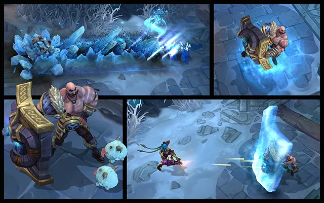

# Braum Landing Page

## Description

This is a landing page for Braum, a character from the video game **League of Legends**. The page provides information about Braum, his abilities, and includes links to external sources for guides and additional details.

## Features

- **Header**: Includes a navigation menu with links to OP.GG, U.GG, and PROBUILDS.NET.
- **Hero Section**: A background image with a brief introduction of Braum and a button to learn more about him.
- **Abilities Section**: A showcase of Braum's abilities, each with a description and relevant image.
- **Inspirational Quote**: An inspirational quote attributed to Braum.
- **Call to Action**: A call to action to learn more about Braum's story on the official Wiki.
- **Footer**: Information about copyright.

## Technologies Used

- HTML5
- CSS3

## Project Structure

braum-landing-page/
├── images/
│ ├── BraumQ.jpg
│ ├── BraumW.jpg
│ ├── BraumE.jpg
│ ├── BraumR.jpg
│ ├── hero.jpg
│ └── mini-hero.jpg
├── styles/
│ └── style.css
├── index.html
└── README.md

## Contributions

This is a Project done as an assigment from the Odin Project - Foundations Course - Project: Landing Page.